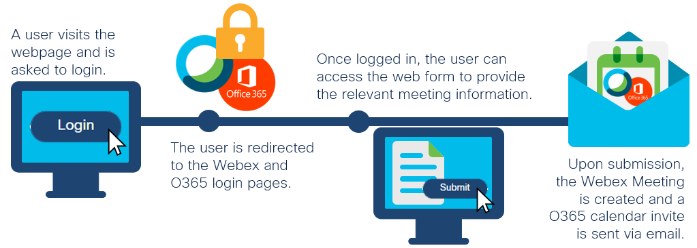
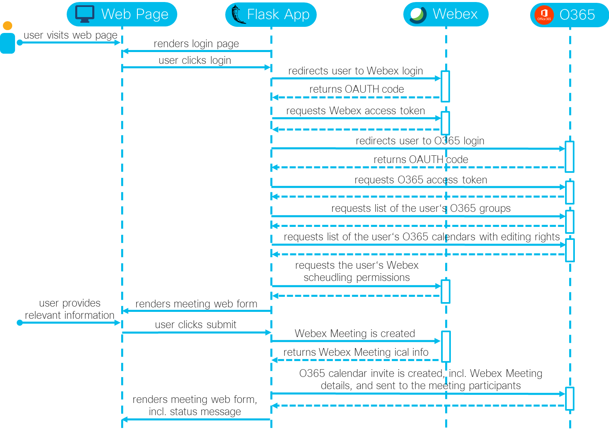

# O365 Calendar incl. Webex Meetings Web Scheduler

An application to schedule a Webex Meeting and send an O365 calendar invite using a simple web form ([watch demo](https://youtu.be/nSuJnPsAC2g)).

## Overview
 

**Webex Meetings**: In this application, a [Webex Meeting](https://www.webex.com/video-conferencing) is scheduled using a simple web form. If a logged in user has the permission to schedule a Webex Meeting for someone else, he/she can also do that (provided he/she also has editing permissions of that person's O365 calendar). 

**O365 Calendars**: Using [Microsoft O365 Outlook](https://outlook.live.com/owa/), a calendar event is created based on the information provided by the user in the simple web form. The O365 event includes the Webex Meetings information and is sent to the selected participants. If a logged in user has editing permissions of another person's O365 calendar, he/she can also create and send an O365 event on their behalf (provided he/she also has the permissions to schedule a Webex Meeting for that person). 

**Web Page**: The user uses a simple web page to login to Webex Meetings and O365, and to provide the relevant information for the meeting. To schedule a meeting, the user has to provide the meeting host/owner, the title of the meeting, the date, and start and end times. Optionally, the user can provide an agenda, required and optional meeting participants based on groups, and whether the meeting is to be repeated.

**Flask**: The application is written in Python using the micro web framework Flask. The web server that is part of Flask should not be used in production. 

### Sequence Diagram:

## Contacts
* Jara Osterfeld (josterfe@cisco.com)

## Solution Components
* Webex, incl. the REST API and Meetings XML API
* Office 365, incl. the MS Graph API
* Flask
* Python

## Prerequisites
- **Webex Meetings**: 
   - **Account**: A Webex Meetings account with SSO authentication is required. Note the host features enabled with the license of the account when trying to schedule a meeting. 
   - **SSO Integration**: If you have admin access to the Webex Control Hub or a sandbox environment, you can enable Single Sign-On authentication following the steps outlined [here](https://help.webex.com/en-us/lfu88u/Single-Sign-On-Integration-in-Cisco-Webex-Control-Hub).
   - **Site**: Note your Webex site name. The site name can be found in the Webex URL (https://< site-name >.webex.com/meet) or if you have admin access to the Webex Control Hub, go to *Services* and select *Sites* under the *Meeting* section to see a list of sites configured for your organization.

- **Webex Integration**: Register a Webex OAuth 2 Integration following the steps outlined [here](https://developer.webex.com/docs/integrations), whereby
    - the *Redirect URI* must be set to: http://localhost:5000/webexoauth
    - for the *Scope*, the following values must be selected:
        - spark:all
        - meeting:schedules_write
   - Once registered, note down the *Client ID* and *Client Secret*.

- **Microsoft 365**: If you do not have access to a Microsoft 365 setup, you can sign up for free to their [Developer Program](https://developer.microsoft.com/en-us/microsoft-365/dev-program), which will provide you with a Microsoft 365 developer instance to play with. 
   - **O365 Account**: An O365 account with Outlook is required. 
      - The developer instance can also provide you with sample user accounts for testing. If you have admin access to the Webex Control Hub or a sandbox environment, you can create Webex accounts for them, too, either by [adding them manually](https://help.webex.com/en-us/v71ztb/Add-Users-Manually-in-Cisco-Webex-Control-Hub) or [using the CSV Template](https://help.webex.com/en-us/nlkiw8e/Add-Multiple-Users-in-Cisco-Webex-Control-Hub-with-the-CSV-Template). Using Microsoft Azure as IdP (also provided in the developer instance), it is simple to set up SSO Webex authentication for those accounts, too ([see here](https://help.webex.com/en-us/mfu88u/Cisco-Webex-Control-Hub-Single-Sign-On-Integration-with-Microsoft-Azure)).
   - **Application registration**: Register a new application in the Azure portal following [these steps](https://docs.microsoft.com/en-us/graph/auth-register-app-v2) and provide the following information in the process:
      1. On the *Register an application* page, give the application a name, choose "Accounts in any organizational directory (Any Azure AD directory - Multitenant)" as *Supported account types*, and set the *Redirect URI* to http://localhost:5000/o365oauth.
      2. Once registered, on the *Overview* page, note the *Client ID* and *Tenant ID*. On the left navigation panel, go to the *Certificates & Secrets* page, and generate a new client secret under *+ New client secret*. Fill in the information, click *Add*, and note the *Value* of the secret.
      3. On the left navigation panel, go to the *Authentication* page, and tick the box for *Access tokens* under the *Implicit grant* section. Click *Save* at the top of the page.
      4. On the left navigation panel, go to the *API permissions* page, and click *+ Add a permission*. Choose *Microsoft Graph* > *Delegated permissions*. Select "Calendars.ReadWrite" and "Directory.Read.All", and click *Add permissions*. Then click *Grant admin consent for < your organization >* and select *Yes*.

- **O365 Shared Calendar/Webex Meetings Scheduling Permissions**: For a user to be able to schedule an O365 event on behalf of another user and make the other user the host of the Webex Meeting, the user needs to have editing rights to the other user's O365 calendar and the other user must have provided the user with scheduling permissions in Webex. You can find information on how to set this up here: [Microsoft](https://help.webex.com/en-us/nkyeiue/Allow-Someone-to-Schedule-Webex-Meetings-on-Your-Behalf-in-Microsoft-Outlook-for-Windows) / [Mac](https://help.webex.com/en-us/y3xvmu/Allow-Someone-to-Schedule-Webex-Meetings-on-Your-Behalf-in-Microsoft-Outlook-for-Mac).  

## Installation

1. Clone this repository with `git clone <this repo>` and navigate to the directory with `cd <directory/to/repo>`.

2. (Optional) Create a Python virtual environment and activate it (find instructions [here](https://docs.python.org/3/tutorial/venv.html)).

3. Navigate to the root directory of the repository, and install the requirements with `pip install -r requirements.txt`.

4. Open the `credentials.yml` file, and fill in the required information. If unsure, the [prerequisites](#prerequisites) chapter outlines where to find the specific values.

5. Set the following environment variable: `set FLASK_APP=main.py`.

6. Start the Flask app with `flask run -p 5000`.

7. In your web browser, navigate to http://localhost:5000/. 

## License
Provided under Cisco Sample Code License, for details see [LICENSE](./LICENSE).

## Code of Conduct
Our code of conduct is available [here](./CODE_OF_CONDUCT.md).

## Contributing
See our contributing guidelines [here](./CONTRIBUTING.md).